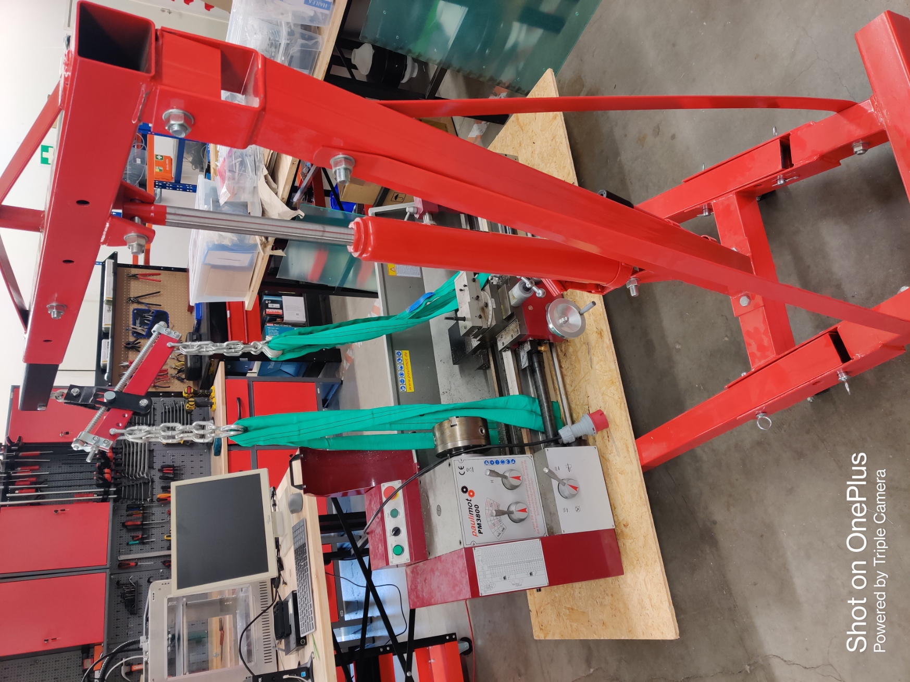
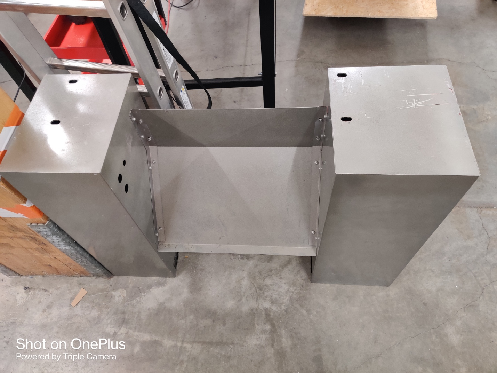

# Week 10

## Connected and caliberated the load cell

We needed to establish a connection between the S-load cell and the HX711 development board. Since the pinouts were not specified, we had to search for information online. Once the connection was made, we linked the HX711 board to the laptop using a USB cable for power supply. However, the readings displayed on the board were not accurate, so we had to calibrate the load cell. The HX711 board had built-in hardware for calibration, including four pushbuttons for different settings.

After making the necessary connections and providing power, if the display showed a value other than 0, we pressed and held the rightmost button labeled "PL" to set it to 0. Then, we pressed the leftmost button to store the new value. If the value did not reach 0 after this adjustment, we pressed and held the leftmost button labeled "DOT" while turning on the "En-b" setting. Once again, we set the "PL" value to 0, and then we pressed the leftmost "DOT" button to store this updated value. At this point, the default value should be 0.

To ensure accuracy, we took an object with a known weight and measured it using the load cell. If the measurement was not accurate, we repeated the entire process again until we achieved satisfactory results.

## Research about the controller and the protocols

Initially, we documented our findings on potential controllers in a Word document to ensure comprehensive record-keeping. We compared the different chips based on their processor, clock speed, FPU (Floating-Point Unit), communication protocols, and cost. To facilitate discussion with the team, we later created a table on Google Sheets to present and evaluate our choice of controllers. 

## Masks for danielle

## Managed the machining area to accomodate the fiberlaser

We are anticipating the arrival of a fiber laser machine to our company, and in preparation, we needed to create space. This involved clearing out the drilling machine, lathe machine, and 12-ton press machine. Removing the drill machine and press machine was a straightforward task that didn't require much time. However, removing the lathe machine proved to be more challenging. The lathe machine weighed approximately 2-2.5 tons, so we had to dismantle it in two parts - the upper section and the bottom part. We detached the top section from the machine's base by unscrewing it and utilized a crane to transport it. The bottom part presented more complexity as the screws were embedded within the structure. We attempted to loosen the screws using a wrench, but they proved to be extremely difficult to remove

