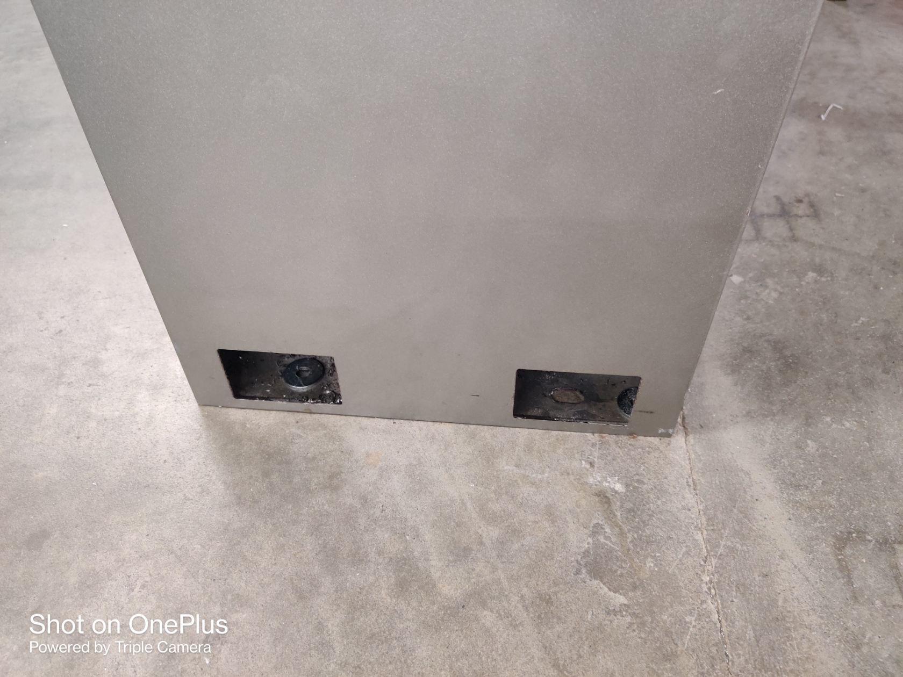
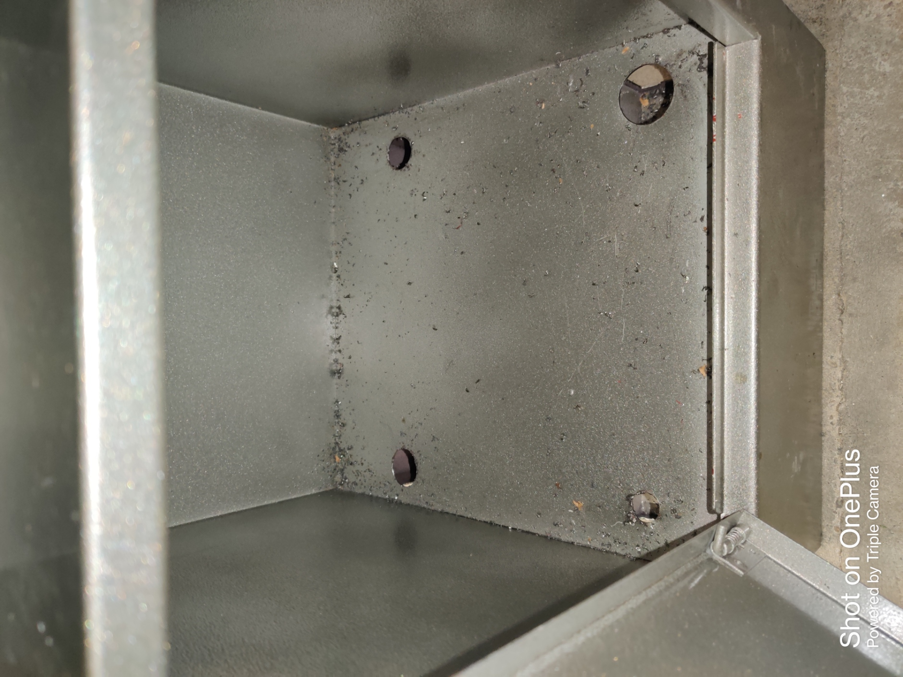

# Week11

## Research about the controller and the protocols

We showed the table that we made to the team. The team expressed the need for additional information, prompting us to update the table with details such as memory capacity, ADC (Analog-to-Digital Converter), DAC (Digital-to-Analog Converter), number of peripherals, programming language support, package type, and number of I/O (Input/Output) pins. We also added 2 more controllers which were not from the ARM fmaily. 

## Lathe Machine

We proceeded with the detachment of the lower portion of the lathe machine from the ground, encountering difficulty due to tightly secured screws. Consequently, we resorted to cutting the machine internally. To facilitate the cutting process, we created a MDF mask with identical dimensions to the machine's body. We employed drill bits of 8mm, 12mm, 16mm, and 21mm sizes for drilling holes, which proved to be a time-consuming task. Although we obtained improved access to the screws from a more advantageous angle, our attempts to unscrew them were partially successful, as the screws' shape and heads began to deform. Ultimately, we resorted to cutting the shaft of the screws.

## Cables for Antenna system

The design of the antenna system is in such a way that we need to extend the length of the cables for the motors. We had to extend the cables for 5 motors by 2-2.5 m. We used a 4 core 0.5mm for the power cable and used a 6 core 0.5mm for the data cable. We also extended the cables for 2 inductive probes. 

## Holes for the aluminium profiles

We made 8 holes for 4 aluminium profiles which will be used for the antenna system. 

## Fibre laser Machine

The company recently acquired a brand-new Fibre laser machine from China, intended for manufacturing other machines. Our task involved receiving the machine and its compressor and ensuring they were properly placed after unboxing. This week, we focused on opening the crates containing the equipment.

