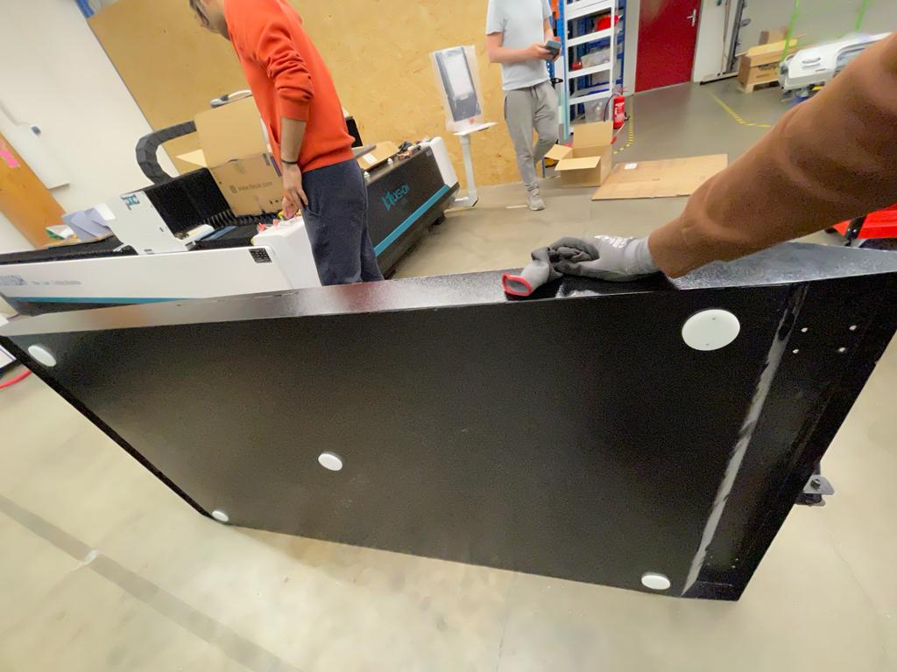

# Week12

## Organized the Storage area

The storage space where additional aluminum, wood, and other materials were stored needed to be emptied to accommodate the compressor from the new fiber laser machine. To accomplish this, we used a pallet jack to relocate the materials to another area. My colleagues assisted me throughout this process.
Later on, the stock will be transferred to a mobile storage unit, which is scheduled to be constructed next week.

Once the storage area was cleared, I, along with the team, diligently moved the compressor to ensure it was positioned correctly without any damage. This task was quite time-consuming as we had to maneuver the bulky machine using a floor jack and a pallet jack in a confined space.

## Installation of Fibre Laser

Moving the Fiber machine proved to be a challenging and time-consuming task. Due to its considerable length, it was difficult to maneuver. Since the company only had one pallet extruder available, we had to improvise by using two roller wheels to support the other end of the machine. The entire team collaborated to push the machine into its desired position. Once the machine was finally in place, I began working alongside another colleague on installing the external components and cables.

However, we encountered a hurdle when trying to position the base trolleys beneath the machine to collect the laser-cut pieces. The trolleys' height exceeded the ground clearance of the laser machine, preventing a smooth fit. Removing the trolley wheels to slide the collector underneath was a possibility, but it risked scratching the machine's underside. To resolve this issue, we laser-cut four acrylic pieces to reduce friction between the floor and the collector, thereby minimizing the chances of scratching.

   

## Small CNC Milling

In preparation for the workshop in Hamburg, the manufacturing of a small CNC machine was initiated. I began by working on the cabling aspect of the machine. A comprehensive list of cables was provided, specifying their purpose and containing descriptions of the required crimping ends.

Once the cable work was completed, my attention shifted to the electronics section of the machine. I proceeded to gather all the necessary electrical and electronic components from the storage area. In instances where certain parts were unavailable, I made note of them and added them to the order list for procurement.

## Re-Installation of old machines

The lathe machine and the drill press machine were reinstalled to a new position, the lathe machine was moved with the same method of using the crane. Before placing the machine holes were drilled in the floor. 

## Reflection

These tasks have been invaluable for my engineering degree and future career. Organizing the storage area improved my understanding of inventory management and efficient material handling. Installing the fiber laser machine taught me problem-solving and teamwork skills, especially when facing challenges like maneuvering bulky equipment. Working on the small CNC milling machine enhanced my expertise in cabling and electronics, essential for designing advanced machinery. Lastly, re-installing the old machines emphasized precision and planning when relocating heavy equipment. Overall, these hands-on experiences have significantly enhanced my engineering skills and prepared me for the practical challenges I will encounter in my future career.