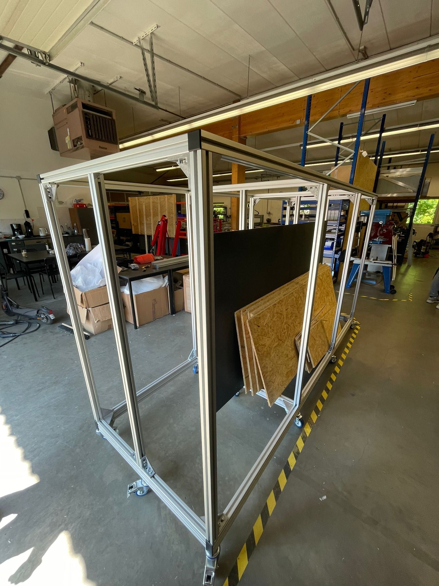
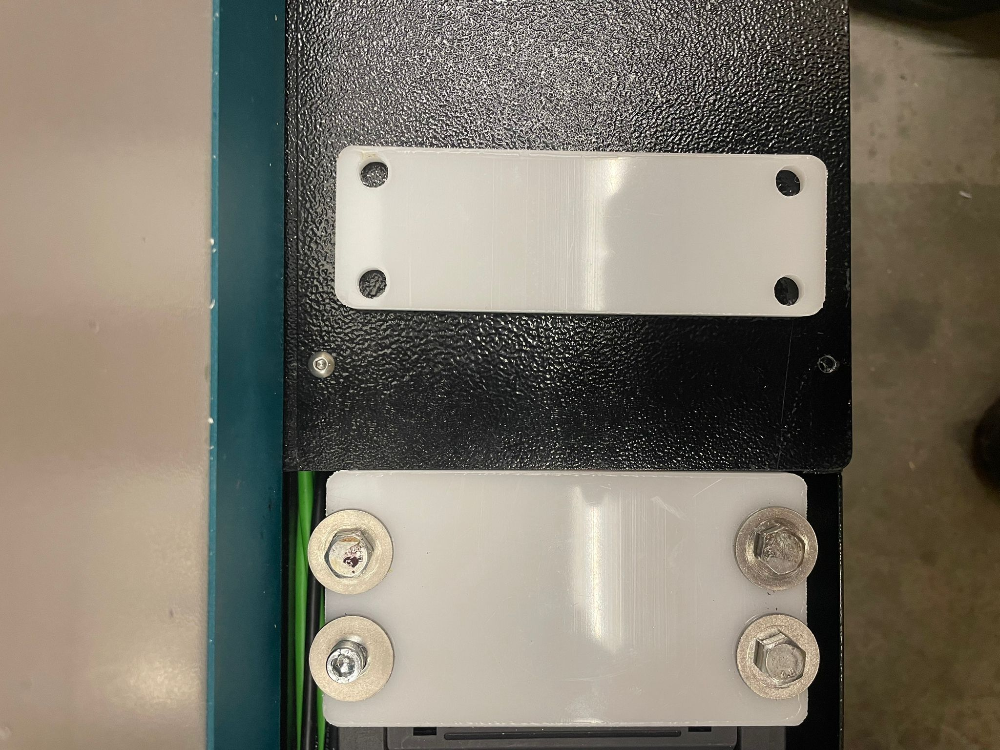
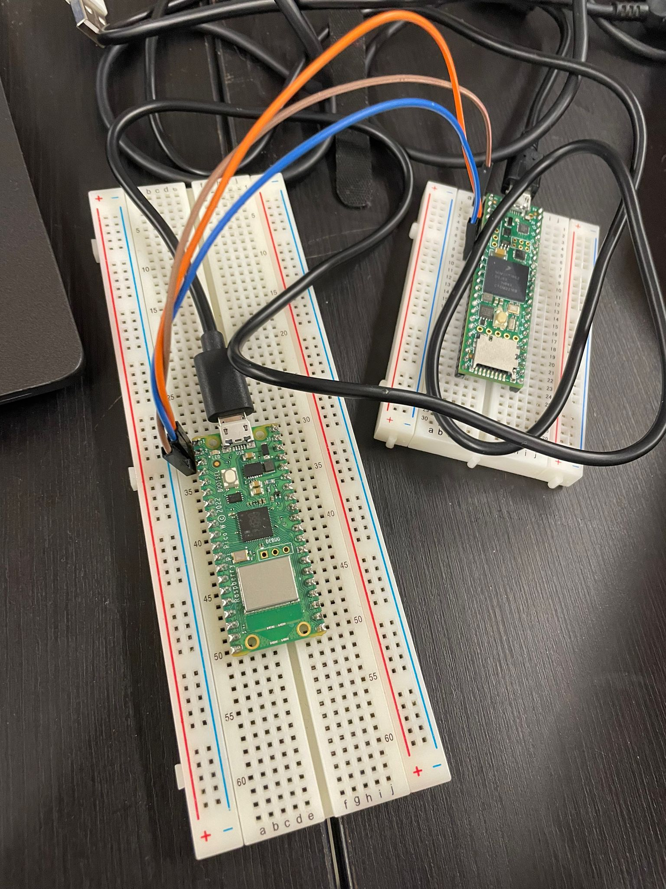

# Week13

## Mobile Storage

I started building the new mobile storage for the extra materials with my colleague. The material and aluminum profiles were ordered for the mobile storage. The storage was an open big cuboid with wheels attached at the bottom. 
I began building it from the bottom layer and attached all the profiles using the 90 degree connector and multiple T- nuts. Similarly, we assembled the remaining rods. The process to build the storage was time taking as the T nuts were not fitting into the profiles as the profiles were not very nice. We had to open the structure multiple times to fit more T nuts. At last we screwd the wheels in the bottom. 

## Fiber Laser

While working on the installation of the machine, there was a section of wires which were exposed and needed to be covered to protect from any sparks from the machine. I designed a plate according to the dimensions of the open area and laser cut the piece using Visicut and UGS. On testing the piece, I realised that the plate is not exactly to the size of the open area. I had to again take the measurements and make chnages in the CAD software. the piece was again cut and it fitted perfectly. 

## Controller research

On the final meeting, the team decided to use the Rasberry Pi Pico 2040 and we recieved the board this week. We recieved 3 boards Pico, Pico W and Pico zero. I had to familiraize myself with the environment of the boards, so I started working on it and read its datasheet. I installed the required software and SDK to work with the board. Me and my colleague finalized to work Arduino IDE instead of microPython as C language is much more efficient and faster. We downloaded all the libraries linked to the board and did some test run. The code worked. We were able to communicate with the board and now we had to see the difference between all the 3 provided boards. To me Pico W seemed to a very attractive option to work with as it could open an opportunity for the team to communicate with the machine wirelessly. 

The Pico will be connected to the laptop and will communicate with the teensy using the UART communication. I had to make the board communicate with another board which is teensy 4.1.  

## Reflection

TThese tasks have provided valuable insights and skills that are highly relevant to my engineering degree and future career. Building the mobile storage enhanced my problem-solving abilities and attention to detail, while the fiber laser installation emphasized the importance of precision and CAD design. Additionally, working with the Raspberry Pi Pico boards expanded my knowledge of embedded systems and programming languages. The decision to use the Arduino IDE showcased the need for efficient tools in engineering projects. Overall, these experiences have not only improved my technical skills but also nurtured the mindset of an engineer, preparing me to tackle real-world challenges with creativity and practicality. These tasks have undoubtedly contributed to my growth as an engineer and will undoubtedly be beneficial in my future endeavors. 
