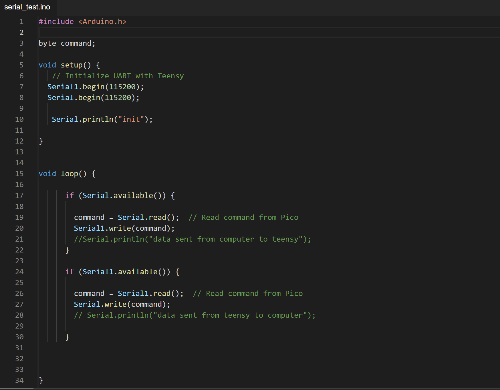
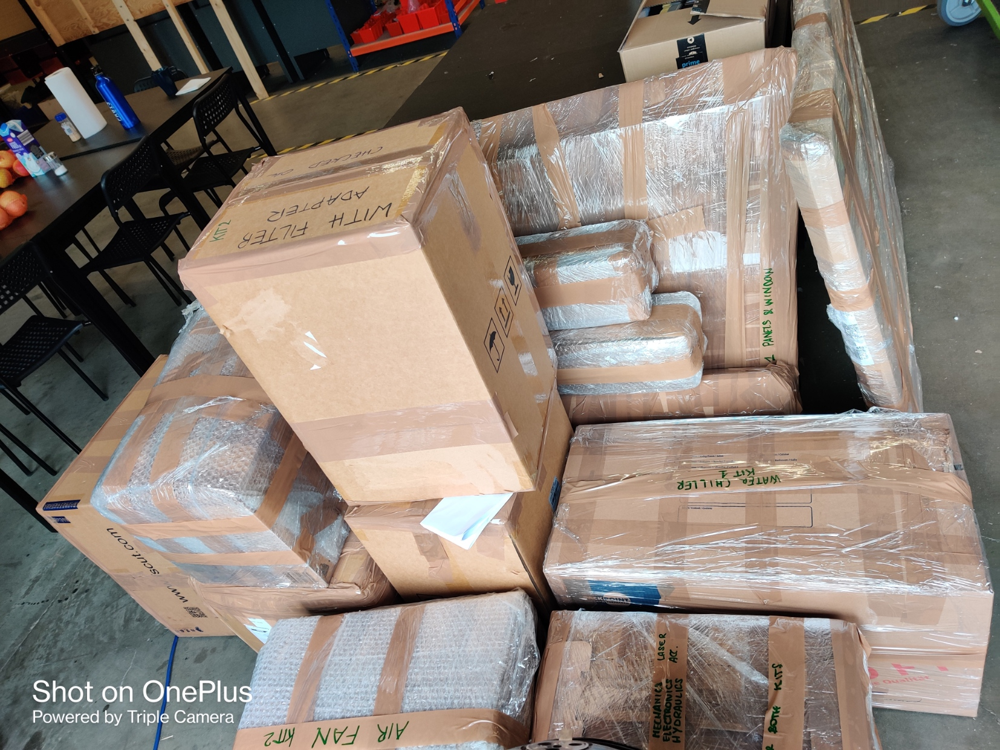
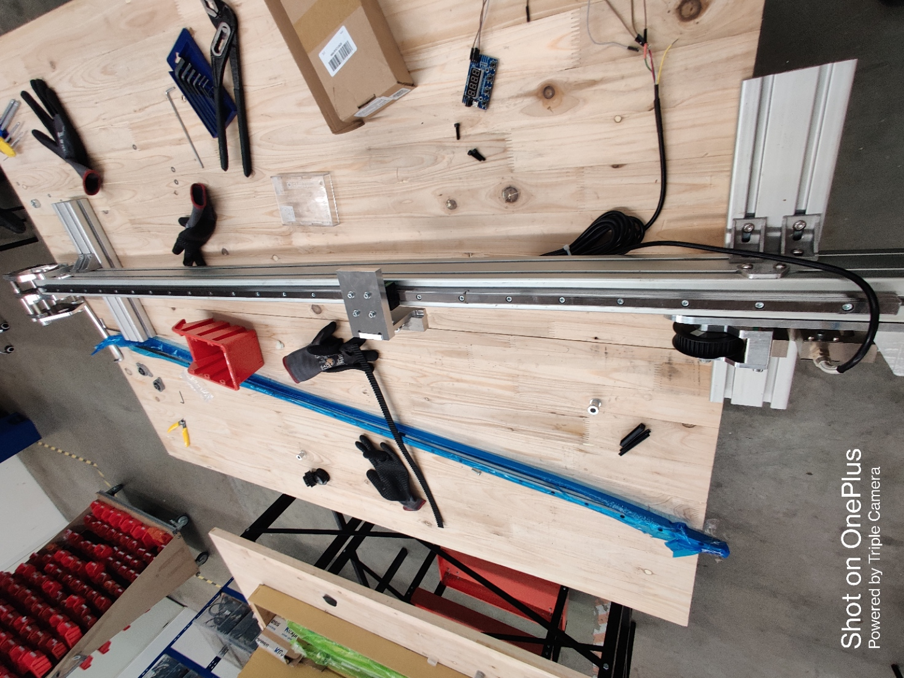

# Week14

## Research Progress

After completing the team's work on the RP2040 Pico, the next step was to establish communication with the Teensy 4.1 board. To enable communication with the Teensy board, I had to install the necessary drivers and libraries in the Arduino IDE. Alongside my colleague, we referred to the datasheets to identify the pinouts for UART communication on both boards.

During the communication setup process, it became apparent that the GRBL firmware, responsible for motion control, needed to be installed on the Teensy board. This firmware is responsible for decoding and executing tasks based on the G-Code instructions. However, the GRBL firmware had restricted access to all Serial ports except the USB port. To establish communication between the Pico and the Teensy, we needed to modify the firmware file to unblock the relevant serial ports. The firmware file proved to be complex and challenging to understand, but with the help of my colleagues, we managed to locate the section pertaining to UART communication.

After modifying the file, we wrote a simple program that would check if any data is availabe on the UART lines between PICO and Teensy. I sent "$$" to get the data regarding the motion control from the teensy on the serial monitor. 
Hecnce, the communication was happening between the boards.

After communicating with the Teensy, I had to program the Pico to get some inputs (G-Code) from the laptop and search for the Tool change command from the input. 

## Packed kits for the Workshop

I helped my team mate to Pack and ship the kit for the Fabulaser machine to Tunisia. We had to pack 2 kits, which took us 2 days to finish. The parts had to be wrapped properly to avoid scratches, cracks etc. 

## Assembled a testing rig 

I had to assemble a testing rig for the new 3D printer. The tesing rig was to check the range for the motor. While assembling, we made an order list for the parts which were missing.

## Reflection

I effectively utilized the knowledge and skills acquired during my university education, particularly in the field of Programming in C. This proved advantageous as the Arduino IDE utilizes a variation of C++, making it familiar territory for me. Additionally, my prior experience with microcontroller programming from the microcontroller and practical electronics course enabled me to efficiently tackle the assigned tasks. 
