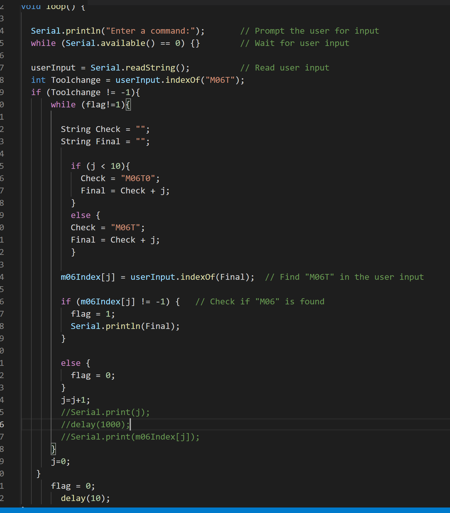

# Week15

## Cables for Antenna System

I assembled the entire electronics section which include components like 2 PCBs, 5 motor driver for the Antenna system and with the help of my collegaue and also did the cables for the stepper motor driver, PCBs, limit switch etc. All the components were placed on a aluminium plate which had the holes for the parts. 

After placing all the electrical components, I cut 4 cable channel of certain lengths using the bandsaw machine and attached them to the plate using the fasteners. 

The plate with all the parts was later put in a housing. On the body of the housing, the emergency button and the Switch button was placed for which the cables were prepared and attached. While working with the cables, lengths of some motors and inductive sensor were increased (soldering or wago connectors) as required. 

Lastly, the focus shifter on making the connections. Initially, I established a serial connection between the power supply, mains switch, and a normally closed emergency stop button. This setup ensures that power is supplied only when both the switch and E-button are closed.

To facilitate the entry of system wirings into the box, cable glands were affixed. Four M25 holes were drilled on the box to accommodate the cable glands. Finally, I brought all the wirings from the system into the box and organized them appropriately.

## Programming Pico

I worked on building a function to search for a tool change command from the incoming G-code. As Pico will be the master controller and will send the data to the teensy regarding the motion control, it will look for tool change command and will take the necessary actions after finding it. 
My goal was to make a code that will look for particular string. On researching on the internet, the tool change commands are M06 and T0,T1 (Tool number). The initial way to find text was to use regexp for which I had to work on it and do some research as i had no clue for it before. 
Alternatively, while looking for regexp, I found indexof() function which was easier to program and implent. 
I made an alternate code using indexof(). 

## Reflection

My proficiency in electronic components, their functionalities, and the correct methods of interconnecting them was crucial for assembling the PCBs and motor drivers. This involved properly connecting various components like the stepper motor driver, PCBs, limit switches, and other parts, showcasing my understanding of electronic components and circuit design and wiring.

By successfully establishing a serial connection between the power supply, mains switch, and emergency stop button, I demonstrated my knowledge of power supply management and the implementation of safety measures.

In terms of programming, my ability to create a function that searches for a tool change command in incoming G-code highlights my practical application of programming skills.
