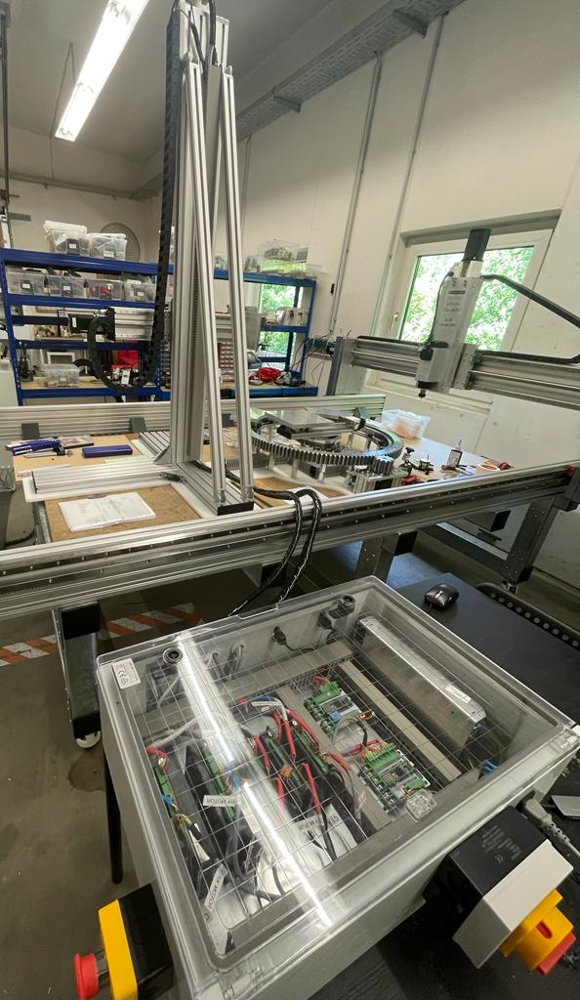
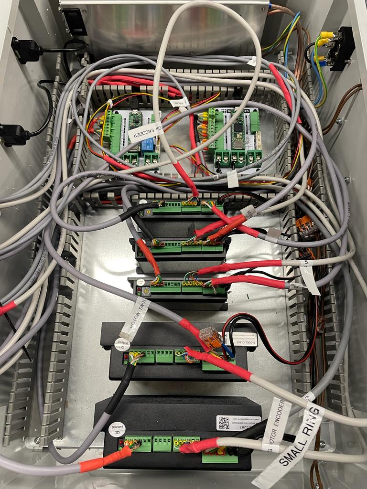

# Week16

## Finalising the Antenna System
Next week, the antenna system will be delivered to the University of Duisburg Essen. My colleague and I were responsible for completing the electronics of the machine. Once we finished the assembly, our next step was to test all the motors and assess their accuracy. Additionally, we needed to verify the functionality of the limit switches installed on the machine.

Initially, we focused on connecting the encoders and signals to the motors. After completing the necessary connections, we began testing the motors together with Daniele. Unfortunately, out of the five motors, only two were functioning correctly. The two working motors operated in open loop mode, while the remaining three motors lacked a switch to disable their closed loop system. We suspected that the first issue might be incorrect connections to the motor driver for the encoder line. However, upon careful examination and consultation of the provided datasheet, we confirmed that the connections were accurate.

Another potential problem we considered was the presence of noise in the wires, which could be caused by their length exceeding 2.5 meters and the relatively small cross-sectional area of the wires (around 0.1 mm^2). To investigate this, we used a multimeter to measure the resistance across the wire from one end to the other. The measured value was approximately 2.5 ohms, which was higher than the resistance measured in the functioning motors (around 0.8 ohms). To address this issue, Daniele ordered a new 6-core wire with a larger cross-sectional area of 0.3 mm^2 to reduce the resistance. Consequently, we had to rewire the connections using the new wire.

After rectifying the noise issue and making the necessary adjustments, we retested the motors. However, they still did not operate properly. We eventually discovered that the datasheet had provided incorrect encoder connections. Fortunately, we were able to find the correct connections by referring to another motor's specifications.

Finally, after resolving all the issues, all the motors worked perfectly with an accuracy of 10 microns, even without any load.

## Reflection

The process of testing and troubleshooting played a crucial role in identifying and addressing issues within the system. It highlights the importance of meticulous testing and investigation to identify potential problems and ensure the system operates as intended.
The involvement of multiple individuals, such as working with a colleague and consulting with Daniele, highlights the importance of collaboration and effective communication within an engineering team. Sharing knowledge, insights, and working together can lead to better problem-solving and more efficient resolution of issues.
