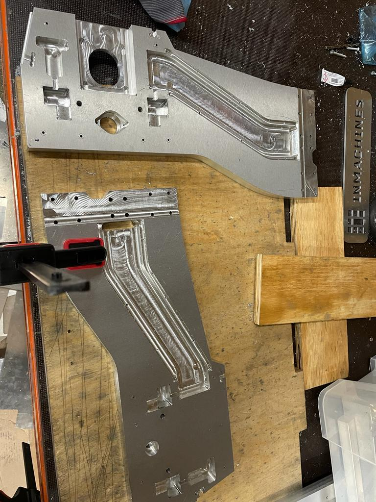

# Week17

## Production of Small CNC Milling machine

This week, we completed the production and assembly of the second version of the Small CNC Milling machine. The machine was designed by one of my colleagues and featured improved capabilities compared to the previous version. The designer also took charge of manufacturing the machine parts. However, as we were running behind schedule, we had to expedite the production process. To assist in this, I cut aluminum profiles and aluminum L brackets to the required dimensions. Following the cutting process, I drilled and tapped all the necessary holes based on the provided CAD model. After the milling of the parts, it was necessary to deburr and countersink them in order to eliminate any sharp edges.

## Assembly of Small CNC Milling machine

Once all the parts were produced, I began assisting with the assembly of the machine. Initially, we tested the fitting of the bottom parts to ensure they aligned properly with the pocket fittings. Some pockets had very tight tolerances, making it challenging to fit the parts together. Additionally, the milling bed was not entirely flat, adding to the difficulties in assembly. To address this issue, I carefully filled the excess material without removing any extra material from the pockets.

After confirming the base, we proceeded to fit the ball screws into the side profiles for the y motion. During the motion check of one of the ball screws, it appeared to be significantly tilted. This problem arose due to a misfit of the ball bearing. The ball bearing had been press-fitted using a hydraulic machine, but the bearings were not perfectly flat. To resolve this issue, we utilized a larger surface to press the bearing in from the higher end, rectifying the misalignment. With this problem resolved, we continued with the assembly process of the machine.

## Reflection

The importance of considering tolerance and fit during the design phase is highlighted. The tight tolerances and difficulties encountered during assembly emphasize the need for precise design specifications and appropriate allowances for fit.