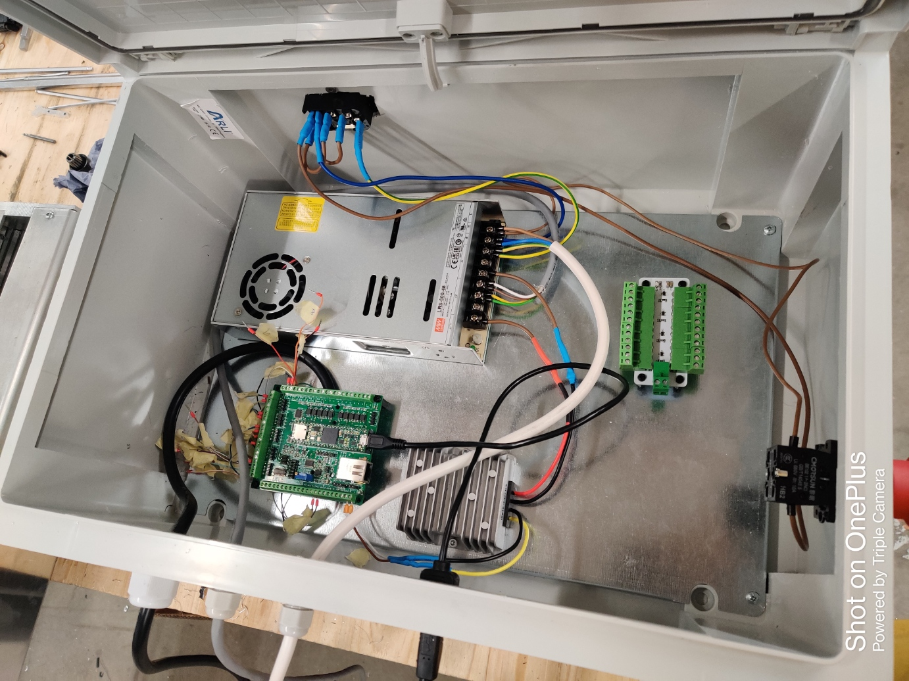
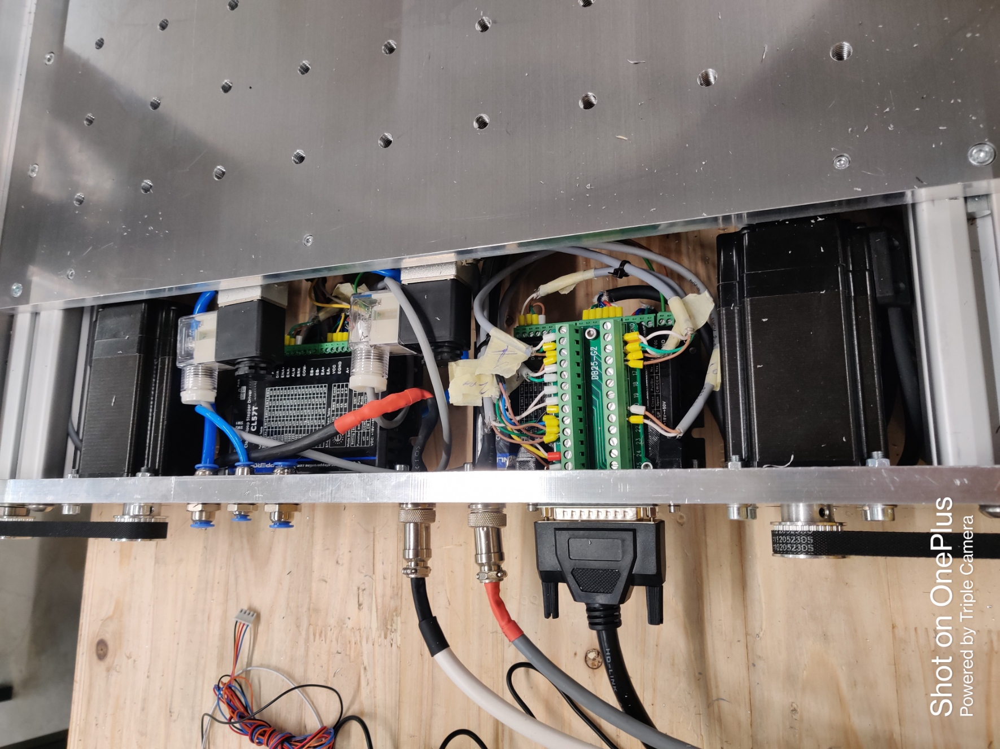

# Week18

## Wirings for the V2 CNC Machine

Once the base was assembled, I proceeded to handle the electronic components of the machine. I had to prepare and manipulate various cables for the spindle, motors, motor drivers, and limit switches, ensuring that they were cut and crimped to the desired lengths based on their intended paths. Additionally, I had to solder the Teensy board for the PCB.

After creating the cables, my next step was to establish connections between the wires and the respective components. To ensure that the machine operates correctly, I needed to connect the DC power supply in series with the emergency button and the mains plug, ensuring that both were in the ON configuration. This connection was critical and required precise execution, as it was also replicated in the Antenna system.

Subsequently, I proceeded to connect the DC power supply to the four Motor drivers, each drawing 48V, using the wago connectors. Following this, I connected each motor to its respective motor driver and then to the PCB.

## Fastners for the cylindrical postioning system

I had to put fasteners in Fusion 360 for the cylindrical postioning system for the BOM. 

## Prepared electronics for laser machine

I began my work on the cables for the Fabulaser mini machine, which is currently being prepared for the workshop. The cables for the motors, motor drivers, and limit switches had to be cut and crimped to the desired lengths. Since I had previous experience working on cables for this machine, I was able to complete this task efficiently and swiftly. After completing the cable work, I shifted my focus to collecting the necessary fasteners for the kit.

## Fibre laser training

Daniele provided us with a fundamental understanding of the Fiber Laser during the training session. He emphasized the necessary precautions that must be taken when operating the machine. Given the high wavelength of the laser, we were instructed to wear special glasses equipped with a green plastic filter capable of withstanding higher wavelengths. 

During the training, we also explored the various features and functionalities of the machine. Daniele introduced us to the edge finder, as well as the nesting capabilities for arranging components efficiently. 

To work with a specific material, we were advised to consult the manual, which outlines the required parameters that need to be set before initiating the cutting process. Currently, the machine is capable of cutting materials such as aluminum and stainless steel.

# Reflection
The tasks reflect the importance of precision, continuous learning, experience, and adherence to documentation in the field of engineering. These elements contribute to successful project execution, efficient work processes, and ultimately, the creation of reliable and high-quality engineering solutions.

