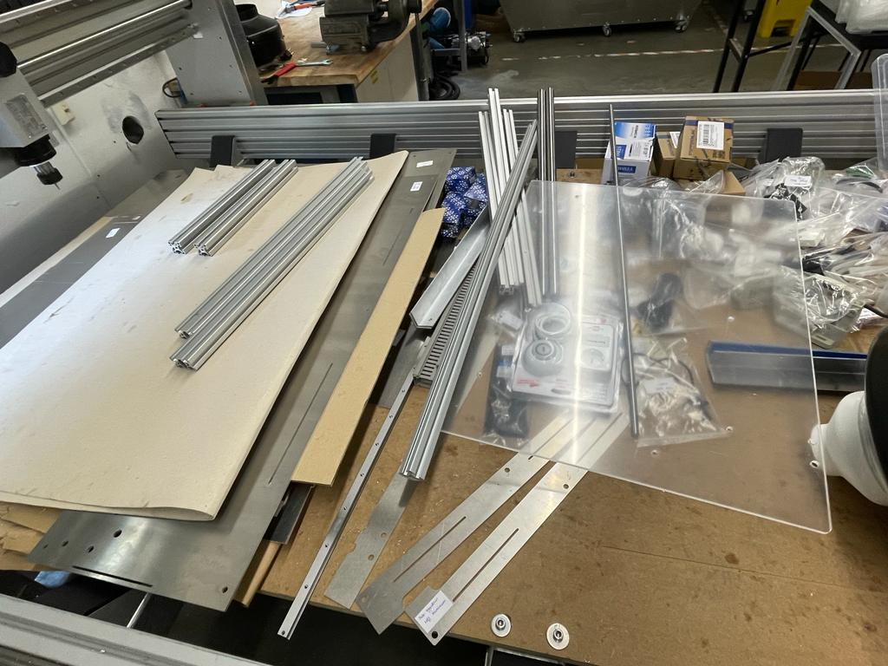
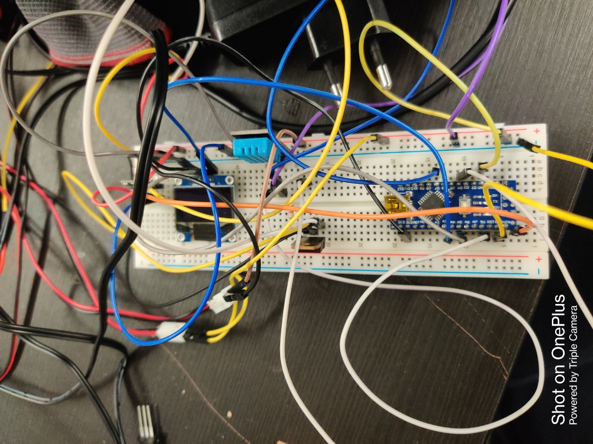

# Week 19 

## Kit Preparation for Fabulaser Mini

The week commenced with addressing leftover cables and fasteners. Following that, I proceeded to assemble all the required components for a machine. The majority of these parts were accessible in storage, where they were appropriately labeled, smoothed if necessary, and marked for ease of assembly. Additionally, some components needed to be 3D printed and integrated into the machine. To achieve this, I generated STL files and converted them into G-code using Prusa Slicer. 

Concurrently, there was a need to prepare another kit for internal company use. This necessitated replicating the entire process, including soldering cables. Any missing components from storage were documented and added to the order list. Also the window panels were laser cut for both the machines. 

## Filament Dry Box

Moreover, I was tasked with a new project involving the research and design of a dry box intended for storing 3D printer filament. Excessive humidity in the environment had been causing filament deterioration, resulting in suboptimal production and material wastage. My initial approach involved considering IKEA boxes, but their dimensions were unsuitable for maintaining filament stability. Consequently, I collaborated with a colleague to develop a custom box made from plexiglass. However, after the design phase, it became apparent that the cost of plexiglass per square meter was prohibitive. Thus, we embarked on a search for alternative materials. In terms of electronics, we opted for a DHT22/DHT11 sensor and an OLED display to monitor weather conditions. Fans and a heater were planned to regulate the box's humidity level using arduino nano. By the week's end, we had begun prototyping the circuit on a breadboard.

Finally, during the week, I acquired a new skill by learning how to operate a vinyl cutter. This newly acquired ability was a valuable addition to my skill set.

## Reflection 

The hands-on experience with CNC machinery, soldering, and component assembly honed my practical engineering skills, giving me a deeper understanding of manufacturing processes and quality control and safety standards.

Designing schematics, dry box and researching for the new project sharpened my design and innovation capabilities. The experience of organization and project management throughout the week will undoubtedly serve me well in future ,ensuring efficient resource utilization.