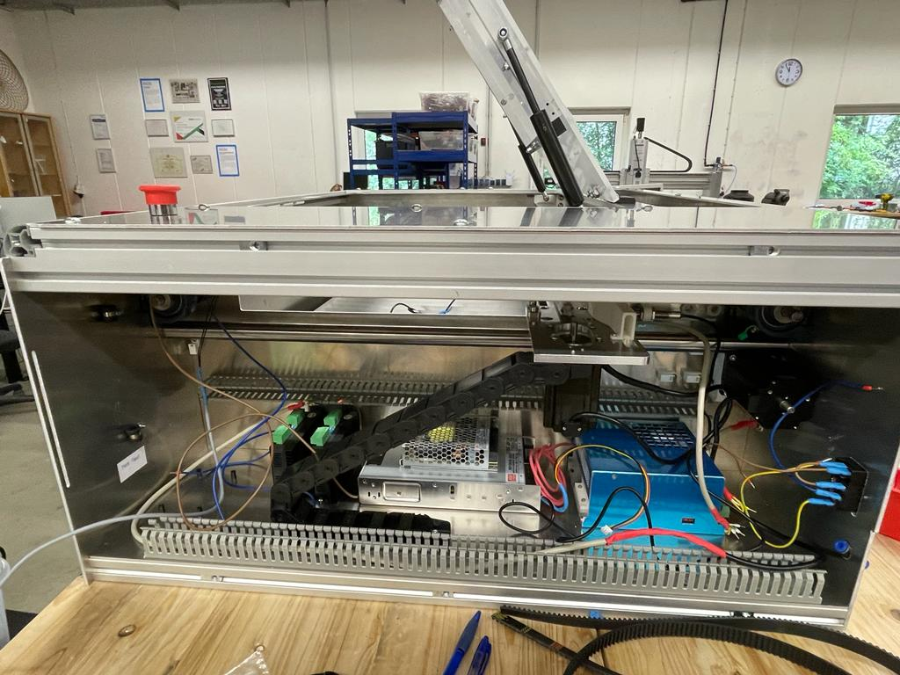
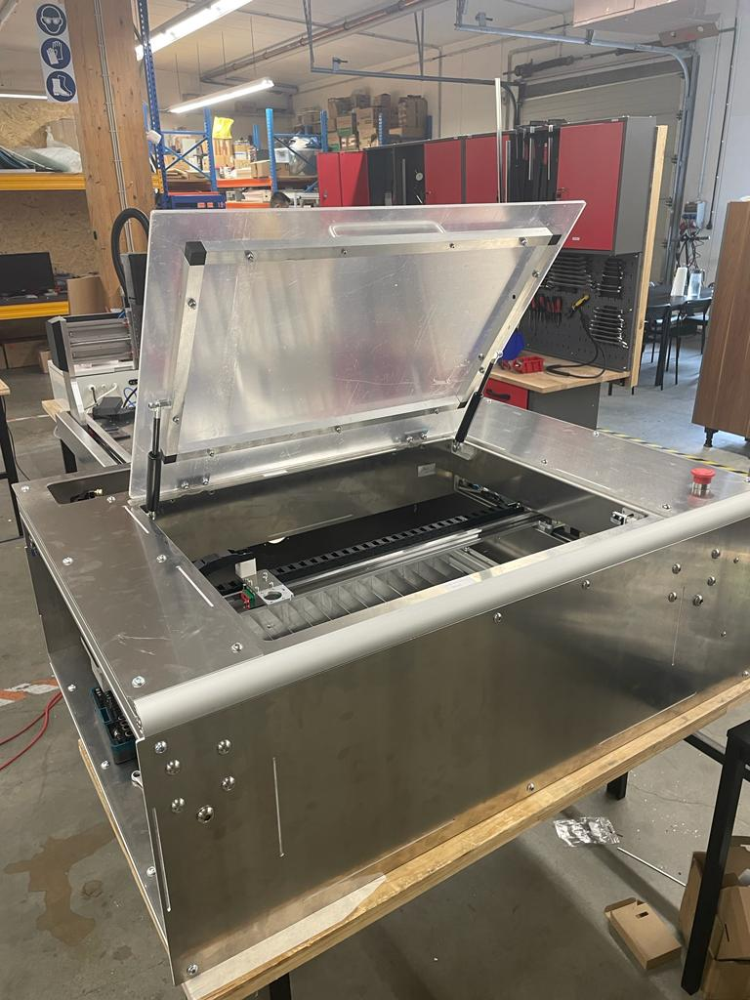
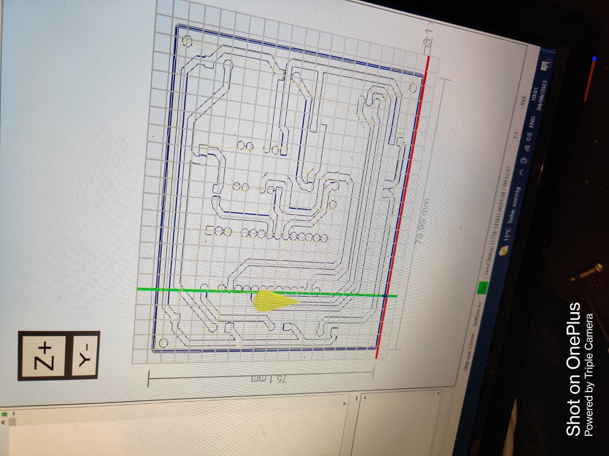
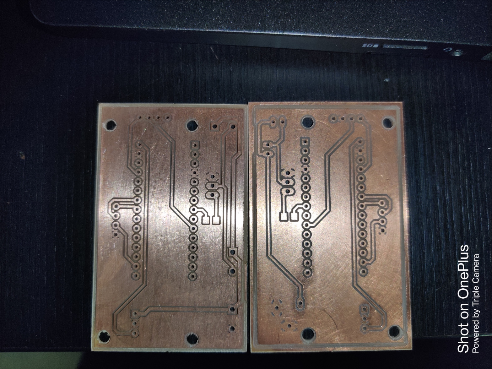
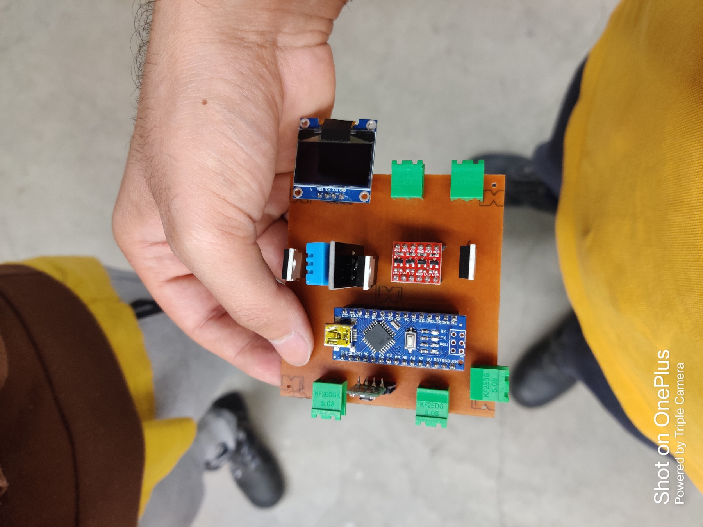
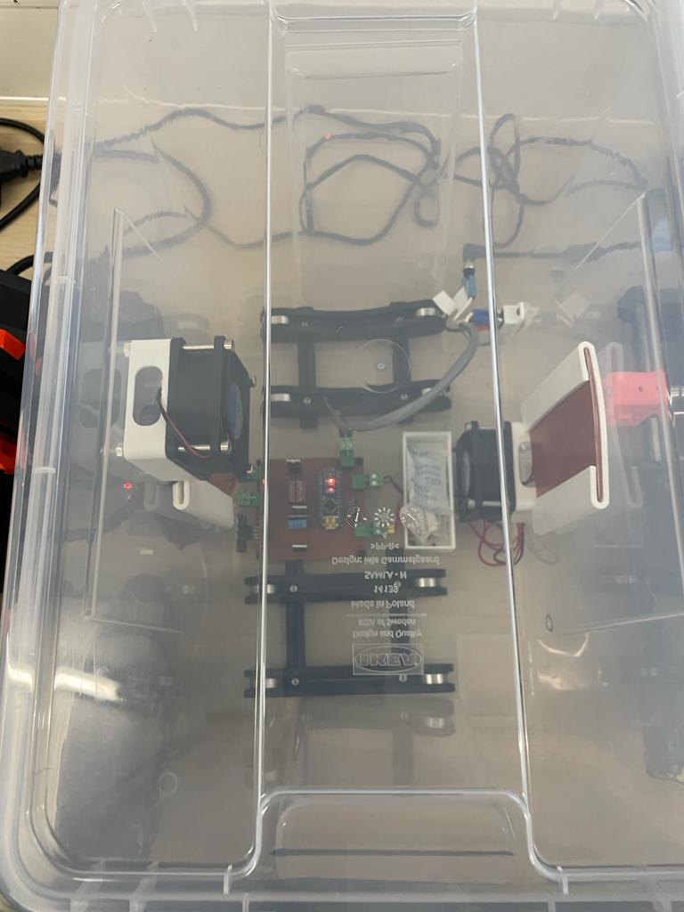

# Week 20

## Kit Preperation and Assembly
  
While getting ready to assemble the Fabulaser kit, there was a need to cut various aluminum profiles, including L profiles, to form the machine's framework. The window panel required four profiles to securely hold it in place. Since two machines were being prepared, a total of eight profiles were cut for the windows. These profiles also needed to be drilled, necessitating the creation of a laser-cut mask to guide the hole placement.

Besides cutting and drilling, tapping was also essential for numerous components in both machines. Following the preparation of all the necessary parts, the assembly process commenced for one of the machines slated for exhibition in a workshop. Collaborating with a colleague, we began with the machine's base and then proceeded to add the electronic components onto it. Our assembly approach progressed from the bottom to the top.

During the assembly process, we encountered several parts with minor issues, which we promptly addressed on-site. Some parts required larger holes, while others needed tapping to properly fit into place.

## Filament Dry Box

As mentioned in the previous report, our electronics prototyping journey began last week by setting up the initial circuit on a breadboard. Our primary goal was to regulate the fans using a suitable transistor. To achieve this, we targeted controlling two 12V DC fans with a combined current of 0.3A. In order to manage both fans using a single Arduino pin, we ensured that the collector current specified in the datasheet exceeded the required current. After evaluating available options, we settled on using the BDX53C FET transistor with a maximum collector current of 8A.

To formalize the design, I created the schematic using EAGLE software, integrated essential libraries into the project folder, and subsequently generated the board view. This initial PCB design was the version intended for milling.

For the PCB milling process, we sought guidance from a colleague who introduced us to EASYEDA and FLATCAM software tools. EASYEDA, akin to EAGLE but more flexible, proved invaluable for removing extraneous holes from the components. FLATCAM was employed to process the gerber file from EASYEDA, generating g-code required for the milling machine.

Following these steps, we successfully milled the PCB, but an issue arose when we realized the bottom layer was not mirrored. This required repeating the process to mill a corrected version.

The first iteration of the PCB enabled fan control. We then transitioned to the second version, which encompassed heater control. The heaters, operating with a 12V 2A load, still fit well within the transistor's collector current specifications. However, upon assembling the board and powering it, we noticed that the transistor controlling the heaters became excessively hot. Research unveiled that the voltage drop across the transistor was generating this heat. This voltage drop, approximately 8V, meant a 4V loss across the transistor. To address this, we acquired N-channel MOSFETs (IRFZ44N) with a drain current capacity well beyond our needs (49A). Given the analogous pin configuration, we directly replaced the transistor with the MOSFET.

Surprisingly, upon testing this setup, the MOSFET exhibited similar characteristics, with overheating and voltage drop concerns. Further investigation revealed that this might be attributed to a low gate voltage threshold. To tackle this, we introduced a level converter that transformed the 5V input from the Arduino into 12V output. In a breadboard prototype, this 12V output was applied to the MOSFET gate, which substantially improved performance. The MOSFET's temperature remained stable, and the voltage drop across the heater aligned with expectations (11.5V).

Subsequently, we finalized the PCB design and successfully printed the final version. With the electronics in place, I designed essential components for the drybox using SolidWorks. These components included the heater holder, fan holder, and a box to house silica gel. Utilizing 3D printing, I fabricated these components and securely attached them to the box.

In the end, the drybox was fully assembled and operational, marking the successful culmination of our efforts.

## Reflection

By engaging in the process of designing, manufacturing, and testing PCBs, I have been able to establish a robust foundation in electronics and circuitry. The careful strategizing, revising, and gradual enhancement of schematics and layouts have significantly honed my capacity for addressing complex issues and maintaining a keen eye for detail. This journey has allowed me to cultivate not only technical proficiency but also a more profound comprehension of the engineering lifecycle, particularly through the phases of PCB design and milling.

This experience has also provided me with the opportunity to acquaint myself with new software tools like FLATCAM and EasyEDA, contributing to the diversification and enrichment of my skillset.

Furthermore, participating in the assembly process of the Fabulaser mini has granted me invaluable insights into real-world manufacturing challenges and strategies for overcoming them. This hands-on exposure has deepened my practical understanding of manufacturing intricacies and the practical application of problem-solving techniques.