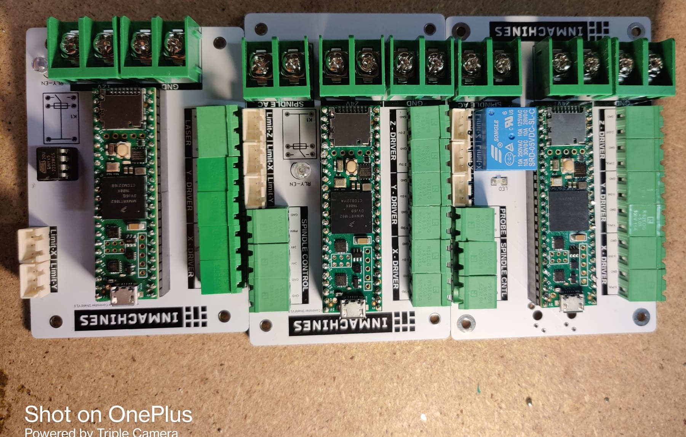
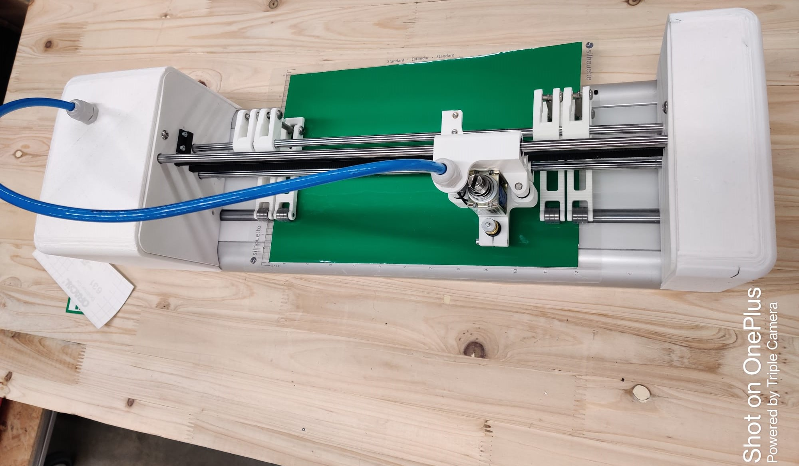
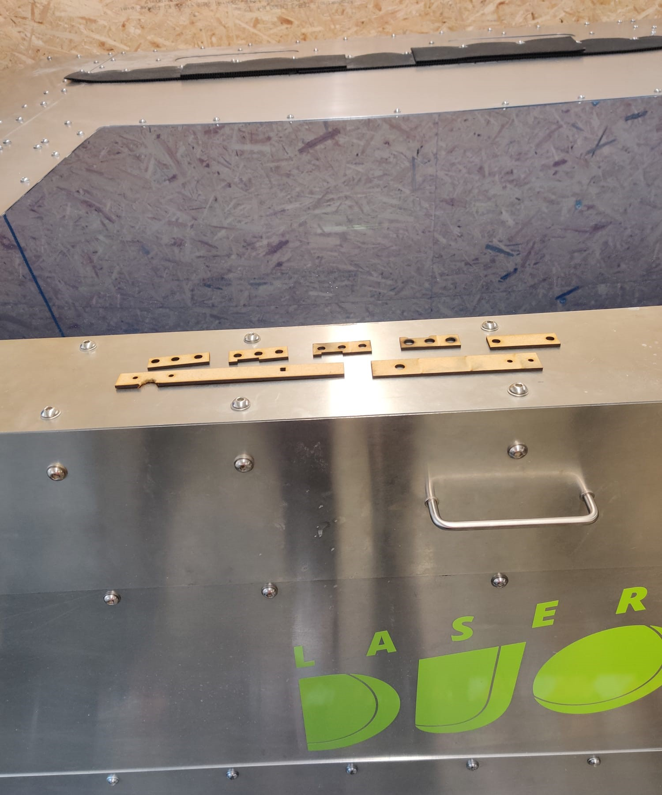
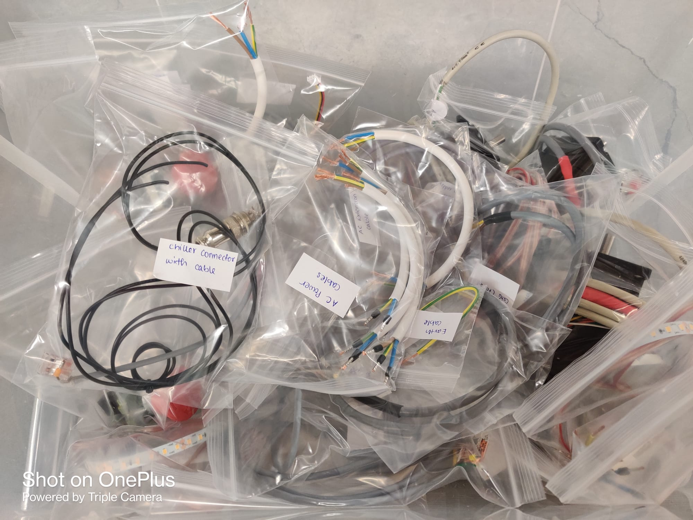

# WEEK 3
## Finished The Task Of Soldering

At the start of the week, we finished making PCBs using the CNC machine. The boards we completed included various components such as a relay, multiple connectors, and the Teemsy4.1-Lou development board. Unfortunately, we were unable to complete one of the CNC boards due to a shortage of relays, which needed to be ordered. Afterwards, we moved on to making laser PCBs using a similar process. We referred to the schematics to determine the values of the resistors, capacitors, transistors, and diodes needed and gathered all the necessary components. Although we soldered the parts and successfully completed the board, we were unable to finalize it due to the same issue with missing relays.

## Bill of Material of Vinyl Cutter

We moved to our next task of the week, which was creating the B.O.M of the vinyl cutter for the fasteners. The process was quite long because it had to be done manually. The CAD software which was used for the designing of the machine didnt have the fasteners mentioned in it, so we couldnt use the software. 

## Learnt about the Laser Cutter

Once we finished working on the vinyl, we moved on to the next task which involved learning about the software required for the laser cutter. Since the company operates with open source machines, the software used was also open source. Specifically, we used two programs called visicut and universal g-code sender. The process of using the software was straightforward. The first step involved importing a DXF file into visicut and creating a .nc file. Then, we exported the .nc file to universal g-code sender. Prior to starting the cutting process, we had to set the zero for the machine and position the material that was going to be cut. Additionally, we needed to start the vacuum to remove the burnt air from inside the machine, use a chiller to keep the laser tube cool, and use a compressor to prevent fire on the material. After completing these steps, we were able to start cutting the desired parts.

## Completed the cables for the laser cutter machine

We continued with the previous task of making cables for the laser cutter machine. It was a tedious task as we had to check onnections for each cable from the laser machine itself and make 2 copies of the each.

## Introduction to Fusion 360 

During our briefing, we were informed about the CAD software Fusion 360, which has widespread use within the company for designing and assisting in the manufacturing process of models. The software boasts a variety of features such as design, rendering, animation, simulation, and more. One particularly helpful feature is the ability to connect with team members via a cloud server. After receiving a basic introduction to the software, we began our task which involved completing a 3D CAD model of a Vinyl cutter by incorporating all the necessary fasteners. This process was made simpler because we had a list of all the required fasteners. Initially, it took us some time to become familiar with the software's functionality. However, we eventually completed the task successfully. We started with another task which was similar to the previous task. We had to put fasteners in the large laser cutter machine using the software. The process was little tedious as the task was partially completed by one of the colleagues and we had to find the spots where it was not done. we couldnt finish the task in this week and will continue next week.

