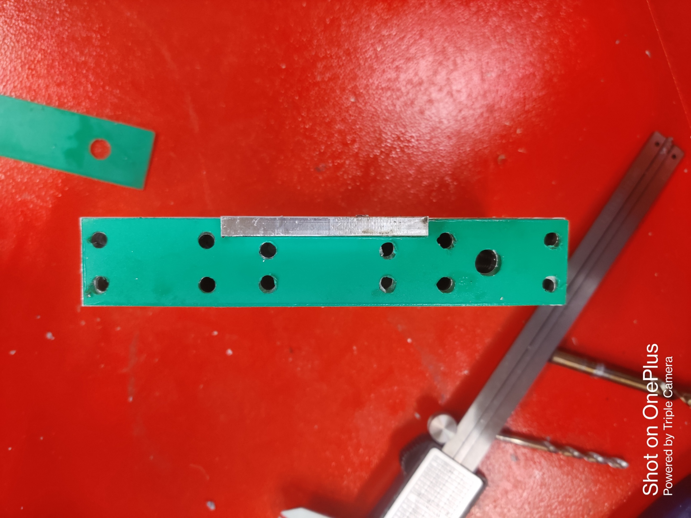

# Week 9

## Organized the workplace

We helped in organizing the electrical and milling workplaces. We kept the unused stuff back and cleaned the area. 

## Drilled & Tapped Holes

To make holes, we had to produce the masks for the parts. We made a dxf file from the fusion 360 and then laser cut the necessary parts. After laser cutting the masks, we attached it to the part using the double-sided tape. Next, we drilled and tapped holes for the small CNC parts.

## Fixed a Laser Duo Machine

Accompanied by Danielle, we visited a company named Insel to repair the laser duo machine which had encountered issues with the nozzle movement and thus was not cutting accurately. Our objective was to identify the root cause of the problem and address it. To begin with, we disassembled the machine, inspecting the motor and electronics compartment. The possible reasons for the malfunction could have been a worn-out motor or short-circuited electronics components due to the machine's age. We used a multimeter to check for any short circuits in the electronics compartment but found no issues. Next, we tested the motor, which exhibited some resistance while rotating the shaft. Subsequently, we replaced the motor and conducted a calibration check before performing a test run. During calibration, we worked on aligning the mirror and the laser tube. After calibration, we ran a test, and the machine was functioning correctly.

## Research about controller

We started working on a new project in which we have to develop a new architecture to implement custom commands in the current machines. The architecture used now has a PC which sends gcode to the controller and the controller converts the G code to a signal that is understood by the motor driver whcih in turn drives the motor.
The project requires a new primary controller which will bridge the PC and the secondary controller and will also give custom commands to the machine like changing the tool. 
This week we worked on the types of controllers available in the market and which communication protocol will we use for the architecture.

